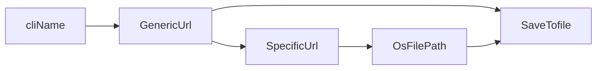

# The pipeline

```
CliName 
   ↓
GenericUrl 
   ↓
SpecificUrl 
   ↓
GetUrl 
   ↓
GetArtifact 
   ↓
SaveArtifact 
   ↓
DecompressArtifact
```


# The purpose

| Step                 | Meaning / Purpose (guessing based on name)                           |
| -------------------- | -------------------------------------------------------------------- |
| `CliName`            | Input: a CLI name (e.g. "kubectl", "helm", etc.)                     |
| `GenericUrl`         | Turn CLI name into a generic URL pattern (e.g. a GitHub release URL) |
| `SpecificUrl`        | Resolve actual version/platform to create final download URL         |
| `GetUrl`             | Send HTTP request to download the content                            |
| `GetArtifact`        | Extract/download the binary data from the response                   |
| `SaveArtifact`       | Save the file to disk                                                |
| `DecompressArtifact` | Unpack archive if compressed (e.g. `.tar.gz`, `.zip`, etc.)          |

---
Here's the pipeline steps in a markdown table:

| Step | File                  | Description                                      |
|------|-----------------------|--------------------------------------------------|
| 1    | cli_name.go           | Emit CLI name                                    |
| 2    | generic_url.go        | Get generic URL from config map                  |
| 3    | specific_url.go       | Parse & replace variables in URL                 |
| 4    | get_url.go            | Fetch the URL content or metadata                |
| 5    | get_artifact.go       | Download the artifact                            |
| 6    | save_artifact.go      | Save artifact locally                            |
| 7    | decompress_artifact.go| Decompress artifact                              |
---

### ✅ What I Like

* It's **clear** and **logical**.
* Each step has **one responsibility** — excellent for pipelining.
* Easy to implement as **separate goroutines and channels**.

---

Do you want to:

1. Define each step's **input/output types**?
2. Start by coding the **first 2 steps** (`CliName -> GenericUrl`)?

Your call — want to continue?


# Todo



